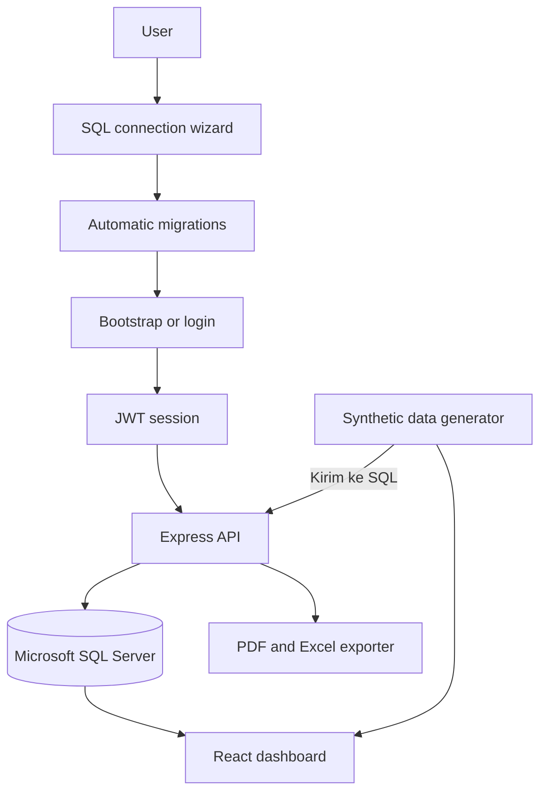

# ERPJIN — PT Hajijin Amri

ERPJIN adalah dashboard Enterprise Resource Planning berbasis web untuk demonstrasi alur operasional perusahaan manufaktur. Aplikasi menggabungkan autentikasi multi-user, role dan permission, Inventory, Purchasing, PPIC, Quality Control, Finance, laporan, serta koneksi Microsoft SQL Server yang dapat dikonfigurasi sebelum login.

Live demo: [erp.hajijinamri.me](https://erp.hajijinamri.me)

> ERPJIN saat ini merupakan project demo dan pembelajaran. Data PPIC, Quality Control, Finance, dan sebagian dashboard berasal dari generator sintetis. Jangan gunakan konfigurasi demo ini sebagai sistem ERP produksi tanpa hardening keamanan dan penyimpanan kredensial yang permanen.

## Highlights

- Wizard koneksi Microsoft SQL Server sebelum login.
- Nama ERP dan nama perusahaan dapat dikustomisasi per database.
- Migrasi schema otomatis setelah koneksi berhasil.
- Bootstrap Administrator pertama untuk setiap database baru.
- Login JWT, password bcrypt, role, permission, dan audit log.
- Pergantian SQL Server melalui halaman Pengaturan; sesi lama otomatis berakhir.
- Inventory dan Purchasing menggunakan data SQL Server.
- Modul demo PPIC, Quality Control, Finance, dan Laporan.
- Data generator dapat dikirim ke SQL dan dimuat kembali untuk menguji koneksi.
- Ekspor data SQL ke PDF dan Excel `.xlsx`.
- Siap dijalankan secara lokal atau pada satu dyno Heroku.

## Demo mode and safety

Dalam mode demo:

- Dashboard menggunakan kombinasi data sintetis dan data SQL.
- PPIC, Quality Control, Finance, dan katalog Laporan dimulai dari data generator.
- Tombol **Kirim ke SQL** melakukan sinkronisasi idempotent ke database aktif.
- Tombol **Muat dari SQL** mengambil kembali data dari database aktif.
- Ekspor PDF dan Excel selalu menggunakan data yang sudah tersimpan di SQL.
- Password SQL tidak pernah dikirim kembali ke browser.
- File `.env` dikecualikan dari Git.
- Pada Heroku, koneksi SQL hanya disimpan di memori satu dyno dan hilang ketika dyno restart.

Gunakan firewall `0.0.0.0/0` hanya untuk pengujian singkat. Untuk penggunaan nyata, batasi port SQL Server `1433` ke sumber jaringan yang diperlukan dan gunakan sertifikat TLS yang valid.

## Architecture



## Features

| Area | Capability |
| --- | --- |
| Connection setup | Format `tcp:HOST,PORT`, connection test, automatic migrations, and local save |
| Application identity | Custom ERP and company names for login, dashboard, browser title, PDF, and Excel |
| Authentication | First Administrator bootstrap, login, JWT session, bcrypt password hash |
| User & Access | User creation, department, multi-role, active status, and permission editor |
| Inventory | Item master, categories, units, warehouses, current stock, and stock transactions |
| Purchasing | Supplier master, multi-item purchase requests, estimated value, approval, and rejection |
| PPIC & Production | Work orders, production targets, realization, progress, and line capacity demo |
| Quality Control | Batch inspections, pass rate, defect rate, hold status, and corrective action demo |
| Finance | Receivables, payables, payments, cash-flow chart, and cost composition demo |
| Reports | Report catalog, search, period selection, preview, CSV, PDF, and Excel export |
| Demo SQL sync | Idempotent synthetic-data synchronization and SQL read-back verification |
| Audit | Login, access changes, user changes, purchasing decisions, and demo synchronization |

## Tech stack

- React 19 + TypeScript + Vite
- Node.js 24 + Express 5
- Microsoft SQL Server + `mssql` / Tedious
- JWT + bcryptjs
- ExcelJS for `.xlsx` export
- PDFKit for PDF export
- Node test runner
- Heroku with `web` and `release` process types

## Connection flow

```text
Isi koneksi SQL
        ↓
Uji koneksi dan jalankan migrasi
        ↓
Buat Administrator pertama atau login
        ↓
Gunakan dashboard dan data SQL aktif
```

Format server mengikuti `sqlcmd`:

```text
tcp:PUBLIC_IP,1433
```

Jika Administrator mengganti koneksi dari SQL A ke SQL B, connection pool SQL A ditutup, migrasi SQL B dijalankan, dan sesi pengguna dihapus. Login berikutnya menggunakan akun yang tersimpan pada SQL B.

Nama ERP dan nama perusahaan diisi saat wizard koneksi pertama. Administrator dapat mengubahnya kembali melalui **Pengaturan → Profil Perusahaan**. Identitas disimpan pada database aktif, sehingga SQL A dan SQL B dapat mempunyai nama aplikasi/perusahaan yang berbeda.

## Local setup

### 1. Install dependencies

```powershell
npm install
```

### 2. Configure environment

Salin `.env.example` menjadi `.env`. Koneksi database boleh dikosongkan agar wizard tampil sebelum login.

```env
SERVER=
DB_PORT=1433
DATABASE=
DB_USERNAME=
PASSWORD=
APP_PORT=3000
JWT_SECRET=
```

Gunakan `DB_USERNAME`, bukan `USERNAME`, karena Windows menggunakan `USERNAME` untuk akun sistem. Jangan commit `.env`.

### 3. Run the application

Untuk menjalankan backend dan production frontend yang sudah dibangun:

```powershell
npm run build
npm start
```

Buka `http://localhost:3000`.

Untuk development dengan hot reload, gunakan dua terminal:

```powershell
# Terminal 1
npm run dev
```

```powershell
# Terminal 2
npm run dev:web
```

Buka `http://localhost:5173`.

### 4. Run migrations manually

Wizard koneksi menjalankan migrasi secara otomatis. Untuk menjalankannya secara manual pada koneksi `.env`:

```powershell
npm run db:migrate
```

## Testing the SQL demo flow

Pada halaman PPIC, Quality Control, Finance, atau Laporan:

1. Klik **Kirim ke SQL** untuk menyimpan data generator.
2. Pastikan sumber data berubah menjadi **SQL Server**.
3. Klik **Data Generator**, lalu **Muat dari SQL** untuk menguji pembacaan ulang.
4. Klik **PDF** atau **Excel** untuk mengekspor data dari SQL aktif.

Sinkronisasi menggunakan kode unik setiap baris. Menekan tombol beberapa kali memperbarui data dan tidak membuat duplikat.

## Heroku deployment

Project dibangun sebagai satu aplikasi. Express menyajikan API dan hasil build React. Release command aman ketika koneksi SQL belum tersedia; migrasi berjalan saat wizard berhasil terhubung.

### 1. Login and create the app

```powershell
heroku login
heroku create NAMA-APLIKASI --stack heroku-26
```

### 2. Configure an optional persistent JWT secret

Config Vars database tidak diperlukan untuk mode demo. `JWT_SECRET` bersifat opsional, tetapi dianjurkan agar sesi tidak berubah setiap restart.

```powershell
$jwtBytes = New-Object byte[] 48
$jwtGenerator = [Security.Cryptography.RandomNumberGenerator]::Create()
$jwtGenerator.GetBytes($jwtBytes)
$jwtSecret = [Convert]::ToBase64String($jwtBytes)
$jwtGenerator.Dispose()
heroku config:set JWT_SECRET="$jwtSecret" -a NAMA-APLIKASI
```

Jangan membuat Config Var `PORT`; Heroku mengaturnya otomatis.

### 3. Deploy and scale one web dyno

```powershell
git push heroku main
heroku ps:type web=basic -a NAMA-APLIKASI
heroku ps:scale web=1 -a NAMA-APLIKASI
heroku open -a NAMA-APLIKASI
```

Gunakan tepat satu dyno karena konfigurasi SQL demo disimpan di memori proses.

### 4. Verify the deployment

```powershell
heroku releases -a NAMA-APLIKASI
heroku ps -a NAMA-APLIKASI
heroku logs --tail -a NAMA-APLIKASI
```

## Scripts

| Command | Purpose |
| --- | --- |
| `npm run dev` | Start the Express backend with watch mode |
| `npm run dev:web` | Start the Vite development server |
| `npm run build` | Build backend and frontend for production |
| `npm start` | Run the compiled Express application |
| `npm run db:migrate` | Apply pending SQL migrations manually |
| `npm test` | Build the backend and test PDF/Excel generation |
| `npm run typecheck` | Type-check backend TypeScript |
| `npm run typecheck:web` | Type-check frontend TypeScript |
| `npm run verify` | Run backend/frontend checks, tests, and frontend build |

## Health checks

```powershell
Invoke-RestMethod http://localhost:3000/health
Invoke-RestMethod http://localhost:3000/health/db
```

`/health` memeriksa proses Express. `/health/db` menampilkan nama database dan server aktif tanpa mengembalikan password.

## Security notes

- Password ERP disimpan sebagai hash bcrypt.
- JWT, status aktif, role, dan permission diverifikasi kembali melalui SQL.
- Query aplikasi menggunakan parameter SQL untuk data pengguna.
- Perubahan akses dan sinkronisasi demo dicatat pada audit log.
- API mengirim header `nosniff`, perlindungan iframe, dan referrer policy.
- File ekspor menggunakan `Cache-Control: no-store`.
- `DB_TRUST_SERVER_CERTIFICATE=true` hanya cocok untuk development atau sertifikat self-signed yang dipercaya secara eksplisit.
- Jangan masukkan password, `.env`, backup database, atau token ke repository GitHub.

## Production readiness

Repository ini siap untuk portfolio, pembelajaran, pengujian SQL Server, serta deployment demo lokal/Heroku. Sebelum digunakan sebagai ERP produksi, tambahkan:

- penyimpanan konfigurasi SQL terenkripsi dan persisten;
- perlindungan khusus untuk wizard setup;
- rate limiting login dan session revocation;
- TLS SQL Server dengan sertifikat valid;
- backup, restore, monitoring, dan disaster recovery;
- pengujian integrasi database dan end-to-end;
- pemisahan data per tenant bila melayani lebih dari satu perusahaan.

## Upload to GitHub

Setelah membuat repository kosong di GitHub:

```powershell
npm run verify
git status
git add .
git commit -m "Publish ERPJIN demo dashboard"
git remote add origin https://github.com/USERNAME/erpjin.git
git branch -M main
git push -u origin main
```

Jika remote `origin` sudah ada, gunakan:

```powershell
git remote set-url origin https://github.com/USERNAME/erpjin.git
git push -u origin main
```

## License

Project ini ditujukan untuk portfolio, pembelajaran, dan demonstrasi aman. Tinjau kembali keamanan, privasi, lisensi dependency, serta kebutuhan operasional sebelum mengadaptasinya untuk produksi.
